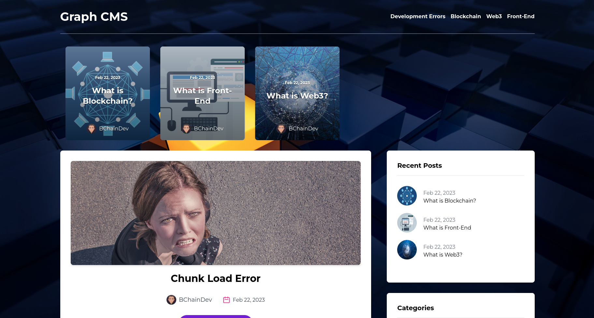

# GraphCMS Blog

This is a blog setup with Next.js, TailwindCSS and GraphQL. The blog has a categories card as well as featured posts accross the top.

## Screenshot:


## Built with:

First, run the development server:

```bash
npm install
npm run dev
```

Open [http://localhost:3000](http://localhost:3000) with your browser to see the result.

## Contribute:
Feel free to a fork the repo or notify me of any issues that are present

## Credit:

JavascriptMastery's tutorial helped me create this project:
https://www.youtube.com/watch?v=HYv55DhgTuA&t=287s

## License:

MIT © BChainDev